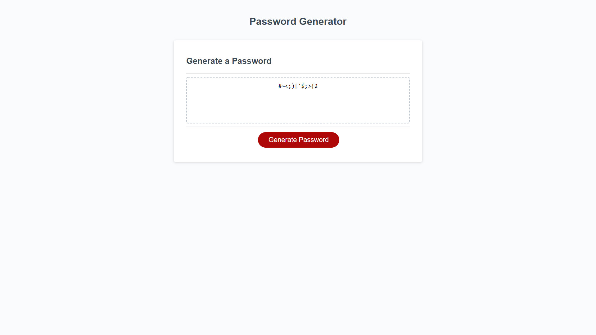

# Password-Generator
For this project I was tasked with making the back-end code for a password generator. The key requirements were allowing the user which characters to include in the password and also dictate the length.

##  "Get Back"
The focus of my work on this was exclusively on the back-end code that allowed the password generator itself to function. This included creating the variables used to store the arrays and strings used throughout and all the logic in order to properly get the correct feedback from the user's input.

## Links

[The Github Repository](https://github.com/JGuerrero126/Password-Generator)

[The Live Application](https://jguerrero126.github.io/Password-Generator/)

## Screenshots

